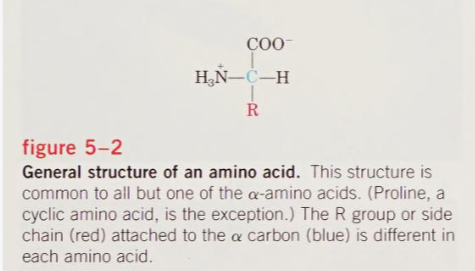

# Lehninger生物化学原理 Chapter 5 氨基酸、多肽和蛋白 

```text
>The best way to have a good idea is to have a lot of ideas. —— Linus Pauling
```

## 前言

为了全面评估我的学习成果并提高我的语言表达能力，我决定开始整理有关生物化学的知识，并将其整理成一系列摘要，供自己学习复习，同时也欢迎他人进行指正和反馈。这个系列摘要将按照《Lehninger生物化学原理（第3版）（中文版）》和《Lehninger principles of biochemistry (3th ed.)》两本书的章节顺序进行总结，以满足我的学习需求。如果您在阅读时发现任何错误或有改进建议，请不吝指出，我将不胜感激。

[^本文并未将蛋白质结构纳入本章中，关于蛋白质结构层次的知识会放在Chapter 6中尽请期待]: 


## 1. 氨基酸  


蛋白质*(protein)*是氨基酸*(amino acid)*间脱水形成的多聚物，相邻氨基酸残基*(amino acid residue)*以特殊的共价键即肽键连接。多种方法可将蛋白质分解为组分氨基酸。关于蛋白质的研究必将集中于氨基酸的研究。

### **1.1氨基酸具有相同的结构特征**


在蛋白质发现的所有20种氨基酸都是α-氨基酸。它们含有连接于同一碳原子(α-碳原子)的一个羧基和一个氨基，以及结构、大小和带电性都不同的侧链或称之为R基团。



<div align='center'>
    <center>
        <font size="2">上图表示了α-氨基酸的基本结构。每一个氨基酸上所连接的R基团都是不同的。</font>
    </center>
</div>           


R基团可以是氢原子，就是最简单的甘氨酸*（glycine）*；再者是甲基就是丙氨酸*（alanine）*；如此越来越复杂，并加入其它种类的原子(如氧或硫)，或额外的胺基或羧基，就可以组成多姿多彩的二十种氨基酸。除甘氨酸外请注意α-碳原子是不对称的，因为它周围的四个原子或基团都不相同；而甘氨酸因为连接有两个一样的氢原子是对称的氨基酸。除了甘氨酸外，其它氨基酸都有其立体异构物。

氨基酸的立体异构物用L-及D-型来表示；**地球上的生物大都是L**-**型氨基酸**。D-型氨基酸仅存在于少数小肽中，包括某些细胞胞壁小肽和抗生素小肽。

关于D-L 系统可以追溯到 *horse and buggy era*时*Emil Fischer* 对碳水化合物的研究。


<div align='center'>
    <center>甘油醛和丙氨酸的L/D型同分异构体 并采用fischer投影式表示</center>
</div>


### **1.2 按照R基团来区分氨基酸**


对标准氨基酸化学性质的认识是理解生物化学的中心，根据R基团的极性*(polarity)*或在生理PH(接近PH7.0)下和水相互作用的趋势分为五大类。


#### 1.2.1非极性脂肪族 R基团

此类氨基酸的官能团是疏水和非极性的。丙氨酸(alanine)、颉氨酸(valine)、亮氨酸(leucine)和异亮氨酸易**在蛋白质内部聚集形成簇，通过疏水相互作用稳定蛋白质结构。**甘氨酸结构是最简单的氨基酸，它是非极性的，但侧链太小对于疏水作用没有真正的贡献。


<div align='center'>
    <center>
        <font size="2"></font>
    </center>
</div>     


#### 1.2.2芳香族 R基团

具有芳香族侧链，参与疏水作用。**酪氨酸的羟基能形成氢键，是一些酶的重要功能基团。**酪氨酸的羧基和色氨酸咪唑环的氮是的他们相比苯丙氨酸有更大的极性。

这三种氨基酸均能吸收紫外光，但苯丙氨酸的吸收程度比另外两种氨基酸要小。这种性质使得许多蛋白质在280处特征性的强烈光吸收，可以做定量检测。


<div align='center'>
    <center>
        <font size="2"></font>
    </center>
</div>     


#### 1.2.3 极性不带电 R基团


这些氨基酸比非极性氨基酸更易溶于水，或说更亲水。因为含有能与水形成氢键的功能基团。此类氨基酸包括丝氨酸(serine)、苏氨酸(threonine)、半胱氨酸(cysteine)、天冬酰胺(asparagine)和谷氨酰胺(glutamine)。丝氨酸和苏氨酸的极性是羟基提供的；半胱氨酸有巯基提供；天冬酰胺和谷氨酰胺由酰胺基团提供。

天冬酰胺和谷氨酰胺易被酸或碱水解，天冬氨酸和谷氨酸分别是这两种氨基酸的水解产物。**半胱氨酸会缓慢氧化形成共价连接的二体氨基酸，称之为胱氨酸***(cystine)*。二硫键连接这两个半胱氨酸分子。二硫键连接的氨基酸残基具有强的疏水性。**二硫键在许多蛋白质结构中扮演着重要角色**。


#### 1.2.4带正电(碱性) R基团

赖氨酸(lysine)

精氨酸(arginine)

组氨酸(histidine)有一个咪唑基团。组氨酸是唯一一个具有接近中性pKa值电离侧链的氨基酸。在许多酶催化反应中，组氨酸残基作为质子供/受体以利于反应进行。


#### 1.2.5带负电(酸性) R基团


天冬氨酸(aspartate)和谷氨酸(glutamate)


### **1.3 非标准氨基酸**


除20种标准氨基酸外，蛋白质可能含有通过对以掺入多肽的标准氨基酸进行修饰而形成的非标准氨基酸。


<div align='center'>
    <center>
        <font size="2">几种常见的非标准氨基酸。</font>
    </center>
</div>     


<div align='center'>
    <center>
        <font size="2">鸟氨酸和瓜氨酸这两种非标准氨基酸在蛋白质中不存在，是精氨酸生物合成和尿素循环的中间体。</font>
    </center>
</div>     


### **1.4 氨基酸具有酸碱特性**


当氨基酸溶于水中，它作为两性离子或者兼性离子存在于溶液之中。

下图是三种不同类型氨基酸(Gly,Glu,His)的滴定曲线。其中横坐标是氢氧根离子的摩尔浓度，纵坐标代表PH值。pI指氨基酸在净电荷为0的点*(isoelectric point)*。


<div align='center'>
    <center>
        <font size="2">   甘氨酸的滴定曲线</font>
    </center>
</div>     


<div align='center'>
    <center>
        <font size="2"> 谷氨酸的滴定曲线</font>
    </center>
</div> 


<div align='center'>
    <center>
        <font size="2"> 组氨酸的滴定曲线</font>
    </center>
</div> 


## 2.多肽和蛋白质

生物学提到的多肽，大小范围很广，从极小到巨大的，由2-3个直到由数千个氨基酸残基连接而成。

氨基酸之间通过缩合反应形成肽键。


<div align='center'>
    <center>
        <font size="2"> 一个氨基酸作为亲核试剂取代另一个羟基，形成肽键。</font>
    </center>
</div> 


### **2.1可以用不同的离子化行为来区别多肽**


组成肽链的氨基酸残基的R基团的电离会显著影响多肽的酸碱性质。和游离的氨基酸一样，多肽具有特征滴定曲线和特征等电点。

### **2.2生物活性肽和多肽大小的范围**


并没有规定，天然存在的多肽由两个氨基酸残基到成千个残基。最小的多肽也具有非常重要的生物学作用。

蛋白质的多肽链的长度变化很大。


<div align='center'>
    <center>
        <font size="2"> 关于一些蛋白质的分子信息。包括分子量等</font>
    </center>
</div> 


一些蛋白质有一条链，而有的含有两条或是更多的多肽链，以非共价键结合的成为多亚基*(multisubunit)*蛋白质。其中多条肽链可以相同也可以不同。由两种以上相同亚基组成该蛋白质称作寡聚*(oligomeric)*蛋白质，相同亚基称作原基*(protomer)*。

我们可以通过将不含其他化学基团的简单蛋白质的分子量除以 110 来计算其氨基酸残基的大致数量。虽然 20 种标准氨基酸的平均分子量约为 138，但大多数蛋白质中较小分子量的氨基酸是多数的； 当我们考虑到蛋白质中各种氨基酸的比例可得平均分子量接近 128。因为每形成一个肽键会去除一个水因此蛋白质中氨基酸残基的平均分子量约为128 -18 =110。


### **2.2多肽具有特定的氨基酸组成**


在酸性条件下水解多肽或蛋白质将获得α-氨基酸的混合物。完全水解时，每种蛋白质的氨基酸混合物有各自的特征比例。20种氨基酸在各种蛋白质中的量几乎从不完全相同。

### **2.3有些蛋白质含有除了氨基酸外的其他化学基团**

许多蛋白质，如核糖核酸酶和胰凝乳蛋白酶原，只由氨基酸残基构成而无其他化学基团，这些蛋白称为**单纯蛋白质。**还含有其他永久连接的化学基团，这样的蛋白叫结合蛋白质，结合蛋白质的非氨基酸部分一般叫做**辅基**。


## 3.如何处理蛋白质


### 3.1 蛋白质可被分离纯化

  蛋白质的来源一般是组织或微生物细胞。任何蛋白质纯化的第一步都是打破这些细胞，释放其蛋白质到**粗提物**(crude extract)溶液中去。可以应用多种方法在粗提物中提纯其中所含一种或者多种蛋白质。然后，按照大小、带电性等特性处理粗提物。这个过程叫**分级分离**(fractionation)。纯化早期的分离步骤是利用受PH、温度、盐浓度和其他因素影响蛋白质溶解度的差异。蛋白质的溶解度一般在高盐下降低，这种作用叫做"盐析”。硫酸铵常被用做沉淀剂。


####   3.1.1**透析**


透析是一种利用蛋白质分子较大的特点从溶剂中分离蛋白质的方法。部分粗提物放在放在半透膜做成的小袋或管中，悬于大量合适离子强度的缓冲液中，膜允许盐与缓冲液进行交换而不允许蛋白质出人。这样的透析在膜内保持了大量的蛋白质而允许蛋白质溶液的盐浓度与膜外的溶液达到平衡。可以利用透析法去除蛋白质制备过程带入的硫酸铵。


####  3.1.2层析

##### 3.1.2.Ⅰ 柱层析

最有力的蛋白质分离方法是**柱层析**(column chromatography),这是利用带电性、大小亲和性和其他特性来分离蛋白质。有适宜化学性质的多孔固体物质(固定相)被填充在柱子中,而缓冲溶液(流动相)从中滤过。含蛋白质的溶液加人柱的顶部,作为流动相的扩展带透过固体介质。各个蛋白质随性质不同而在柱中移动得有快有慢。例如阳离子交换层析中,固体介质为带负电基团。流动相中，带净正电的蛋白质在介质上的移动速度比那些带净负电荷的蛋白质要慢的多，这是由于前者与固体相的相互作用阻碍了它的移动。两种蛋白质可因带电性不同而被分成两个区带。蛋白质条带在液体相(蛋白质溶液)里的扩展是不同性质造成的蛋白质分离作用和自由扩散的共同结果。随着柱长的加大,两种净电荷不同的蛋白质的分辨率一般将提高。但是柱长加大后蛋白质溶液流过柱子的速度将减小，**随着花在柱上的时间加长，分辨率将由于各蛋白质条带的自由扩散而下降。**


<div align='center'>
    <center>
        <font size="2"> 柱层析示意图</font>
    </center>
</div> 


##### 3.1.2.Ⅱ 离子交换层析 

利用一定pH下不同蛋白质带电种类和电量的差异，柱介质是结合着带电基团的合成的聚合物。结合着阴离子的称为阳离子交换树脂*(cation exchanger)*，结合阳离子的称为阴离子交换树脂*(anon exchanger)*。这里显示了一个阳离子交换层析的例子。每个蛋白质对柱上离子基团的亲和力受 pH 的影响(pH决定分子的电离状态)和周围溶液中竞争性的自由盐离子浓度的影响。逐渐改变流动相的 pH和/或盐浓度例如建立一个梯度，可以优化分离效果。


<div align='center'>
    <center>
        <font size="2"> 离子交换层析</font>
    </center>
</div> 

##### 3.1.2.Ⅲ 大小排阻层析


大小排阻层析*(size-exclusion chromatography)*,又叫凝胶过滤，按分子大小分离蛋白质。柱介质是交联的有选择孔径的聚合物。大的蛋白质比小的移动得快.因为它们太大而不能进入介质的小孔,所以穿过柱子所走的路径更直接。小的蛋白质进人孔中的迷路而走了较长的路径,较慢穿过柱子。


<div align='center'>
    <center>
        <font size="2"> 大小排阻层析</font>
    </center>
</div> 


##### 3.1.2.Ⅳ 亲和层析


亲和层析*(ainitychromatography)*是通过结合特异性来分离蛋白质。与交联在介质上的配体特异性结合的蛋白质被保留在柱上。(生物化学的“配体"-词是指结合到像蛋白质这样的大分子上的基团或分子)。在不结合配体的其他杂蛋白质穿过柱子并被洗去后.用含自由配体的溶液洗脱收集目的蛋白质从上洗下)。


<div align='center'>
    <center>
        <font size="2">  亲和层析</font>
    </center>
</div> 


##### 3.1.2.Ⅴ HPLC

一种精细的现代化层析方法是HPLC。利用高压泵加速蛋白质分子沿着柱子向下运动，并使用能耐受高压的高质量层析材料，通过减短过柱时间，HPLC限制蛋白质条带的扩散，提高分辨率。

在蛋白质纯化的过程中，首先会使用廉价的方法,例如盐析，此时样品总量和杂质最多。在较早阶段一般不会使用层析法，因为蛋白质量大的介质量也要加大。在纯化较厚阶段会使用相对昂贵的层析法。

#### 3.1.3 电泳


另一个分离蛋白质的重要技术是建立在带电蛋白质在电场中发生移动的性质上，这一过程称为电泳*(electrophoresis)*。电泳可以分离和定性分析蛋白质。但一般不用于纯化大量蛋白质，因为电泳经常对蛋白质结构不利、进而影响其功能。

电泳作为一种分析手段尤其有用。它的优点不仅是使蛋白质分离而且可见，使研究人员能快速估计混合物中不同蛋白质的数量和某个特定蛋白质的纯度。同时,电泳可以测定蛋白质的重要性质例如等电点和粗略分子量。蛋白质电泳普遍在聚丙烯酰胺凝胶中进行。聚丙烯酰胺凝胶作为分子筛可大体上按照蛋白质的电荷质量比减缓其移动，蛋白质的形状对移动也有影响。


将不同样品加于聚丙烯胺凝胶上部的小孔或槽内。在外加电场下蛋白质进人凝胶。固态凝胶使由于温度梯度略有变化而引起的对流降至最小，防止除电场外其他因素引起的蛋白质运动。

根据上图在电泳结束后,用染料如**考马斯亮蓝**(与蛋白质结合而不与凝胶结合)溶液浸泡使蛋白质染色可见。**凝胶上的每条带代表一种不同的蛋白质(或蛋白质亚基)**:较小的蛋白质在胶中移动得比较大的蛋白质快，因此出现在接近凝胶底部的地方。这块凝胶显示了从***E. col***中纯化 RNA聚合酶的结果。第一泳道为细胞抽提物中的所有蛋白质。从左向右依次为每经过一个纯化步骤后显现的蛋白质带。正如最右侧的泳道所早现的,纯化了的蛋白质有 4 个亚基。

##### 3.1.3.I SDS电泳法

用去污剂**十二烷基磺酸钠(SDS)**的电泳可以预估蛋白质纯度和分子量。SDS能和大部分蛋白质结合，结合的量基本与蛋白质分子量成正比，大约每两分子基酸结合一分子SDS。与SDS结合后使得蛋白质本身的电荷变得不明显，造成所有蛋白质的质荷比相同，构象也发生了改变，大部分蛋白质呈现相似形状。若只采用与蛋白质染色而不与其他物质结合的考马斯亮蓝染色，就可以检测蛋白质纯化的过程。


蛋白质在SDS 聚丙烯胺凝胶电泳中的迁移率与其相对分子质量(M)相关。根据上图已知相对分子质量的标记蛋白质。这些标记蛋白质可被用来估测未知蛋白质的相对分子质量。

标记蛋白质相对分子质量的对数值与电泳相对迁移率作图成线性，未知相对分子质量的蛋白质可从图上读出


<div align='center'>
    <center>
        <font size="2"> SDS结构式</font>
    </center>
</div> 


##### 3.1.3.Ⅱ 等电聚焦


等电聚焦*(isoelectric focusing)*是用来确定蛋白质等电点(pl)的方法。通过低相对分子质量有机酸和碱混合物在外加电场的凝胶中的分布可建立一个 pH 梯度。当蛋白质混合物加入时,每种蛋白质移动到与其 pl 相等的pH处停止。因此不同等电点的蛋白质在凝胶中有不同的分布。


##### 3.1.3.Ⅲ 双向电泳

结合前两者的方法的过程叫双向电泳


<div align='center'>
    <center>
        <font size="2"> 超过 1 000个来自 E.coli 的不同蛋白质可用这项技术分离开</font>
    </center>
</div> 


#### **补充：质谱法研究蛋白质**


长久以来质谱法就是化学研究中不可缺少的工具。被分析的分子，称为分析物 *(analyte)*，先在一个真空室中被离子化。当新带上电的分子被引入电场或磁场时，它们在场中走过的路径是一个质量电荷比 m/z 的函数。不同电离离子的这一特性是可测知的，并用于推导分析物的精确质量。

其一是将蛋白质置于光吸收介质中，在短脉冲激光作用下电离，并从介质中被吸收人真空室。这一过程称为基质辅助激光解析/电离质谱(MALDI MS)已经开始成功应用于大分子。


第二种方法电喷雾电离质谱(ESI MS)。在穿过电针时加入的质子使大分子带上了额外的电荷分子的m/z可以在真空室内分析。

关于蛋白质测序可以使用串连色谱。


### 3.2未分离的蛋白质可被定量

##### 3.2.1 酶蛋白

对于酶蛋白质,在抽提容液或组织中所占的量可通过测定或分析酶的催化效力来定量，即当酶存在时底物转化为反应产物的速率升高。为此我们必须知道

(1)催化反应的全部平衡(2)确定底物消失或产物出现的分析方法，(3)酶是否需要金属离子或辅酶等辅因子

(4)酶活性对底物浓度的依赖程度 (5)最适 pH (6) 使酶稳定和有高活性的温度范围。一般在最适 pH 和 25~38°C 的适宜温度下分析酶。

一个酶活性单位定义为在最佳测定条件下,25°C 时每分钟转化 1.0 μmol 底物所需的酶量活性*(activity)*一词是指溶液中酶的总单位数。

比活性*(specific activity)*是指每毫克总蛋白质中的酶活性单位数。比活性是对酶纯度的度量:在酶的提纯过程中比活性增加,在纯酶时最大并且恒定。


##### 3.2.2非酶蛋白


一般认为蛋白质已经提纯了对于那些非蛋白质,要根据特点**采用其他定量方法**。转运蛋白可通过分析其结合的转运分子来检测;激素和毒奈可测定它们产生的生物效应，如生长激素会刺激特定培养细胞的生长。


## 4.蛋白质的共价结构


不同的蛋白质之间最明显的差别就是它们具有不同的结构，在各个结构层次上都有表现。

一级结构的差别尤其富含信息。每种蛋白质有不同的氨基酸残基种类和数量。结构又决定了蛋白质的功能。氨基酸顺序和蛋白质功能是紧密联系的，关于描述如何确定氨基酸序列也是本节的重点。

### **4.1 氨基酸序列决定蛋白质功能**

每种蛋白质各有其特有的三级结构，形成独特的功能。不同功能的蛋白质总是有不同的氨基酸序列。**如果一级结构发生改变，蛋白质的功能也可能发生改变。是的，仅仅是可能。**

对于一个特定的蛋白质其结构是绝对固定不变的吗？其实也并不是，有些变化是可能的。大约20%-30%的人类蛋白质是多态的(polymorphic)。在人群种有氨基酸序列的变化，这些变化对大多数蛋白质功能是不影响的。而且，关系较远的物种间执行相似功能的蛋白质在大小和氨基酸序列上可能有很大区别。

在蛋白质的氨基酸序列中常有关键区域，直接影响其功能。关键区域在不同蛋白质间互不相同，使得联系序列与三级结构、结构与功能之间的关系变得很复杂。

### **4.2 众多蛋白质的氨基酸序列已被测定**

  在1953年有两个伟大的发现。一是James D. Waston 和 Francis Crick 提出DNA的双螺旋结构，奠定了遗传物质精准复制的结构基础。同年，Frederick Sanger解开了人胰岛多肽链的氨基酸序列，震惊世界。


<div align='center'>
    <center>
        <font size="2"> 上图牛胰岛素蛋白氨基酸序列</font>
    </center>
</div> 

许多物种的成千种蛋白质的氨基酸序列已经借助于Sanger首先发展的测定原理得以测定。这些方法在现在仍被广泛应用。

### **4.3 短肽测序的自动化**

分析蛋白质的一级结构可以通过水解蛋白质并测定其氨基酸组分。氨基酸组分信息对于解释其他方法得到的结果也有价值。可以用来鉴定不同实验室的分离蛋白质是否相同。但只用水解法无法确定氨基酸序列。

##### I Sanger 法

标记和测定末端氨基酸残基是于蛋白质水解经常连用的方法。Sanger发展了一种试剂二甲基氨基萘磺酰胺(dansyl chloride)是比二硝基苯更容易检测的衍生物。用一种试剂标记氨基酸残基后，将多肽水解，从混合组分中确定标记分子。**此法只能测定N端，不能测定整个序列，但可以测试有多少N端不同的肽链。**


##### Ⅱ Edman 降解法

为测定完整多肽的序列往往使用 *Pehr Edman*化学方法。Edman 降解法*(Edman degradation)*标记从肽链脱去氨基端残基，保留其他肽链。**多肽**和**异硫氰酸苯酯**反应，氨基酸残基最作为**乙内酰苯硫脲衍生物**从肽链上脱去。在确定了氨基酸残基吼，暴露的新氨基酸残基又可以通过相同方式循环标记，脱去被测定。该方法灵敏，只需要几个μg的蛋白质样品可以测定整个氨基酸序列。


#### 4.3.1大的蛋白质需要分解成较小片段

#### I. 打开二硫键

二硫键会干扰测序 因此需要先打断二硫键，方法如下图所示


<div align='center'>
    <center>
        <font size="2">过甲酸氧化/二硫苏糖醇还原</font>
    </center>
</div> 


#### Ⅱ  多肽链的切割


有几种方法可使脑链片段化。蛋白酶*(protease)*可以催化肤键的水解。有的蛋白酶只切开特定氨基酸间的肽键这种链的片段化是可预计和可重复的。一些化学试剂也能在特殊位置切开肽键。


#### Ⅲ 肽段测序

使用Edman法，排序则是因为还需要确定酶切所得各片段的先后次序。


####  Ⅳ肽段排序

还需要确定酶切所得各片段的先后次序。用切割不同位点的其他酶或试剂处理完整多肽,得到另一套片段。如采用澳化氰,将只切开基由甲硫氨酸提供的肽键。第二种方法获得的脑段同样做分离和测序。

分析比较两种方法所得片段的测序结果，找出二者的重叠部分，借助重叠肽确定原肽链的位置。


<div align='center'>
    <center>
        <font size="2">氨基酸测序的一般步骤</font>
    </center>
</div> 

#### Ⅴ 定位二硫键


如果一级结构有二硫键，在测序完成后需增加一个步骤。将蛋白质样品再用试剂切割,这次不事先打断二硫键。将所得各片段电泳分离后与原来的一组片段比较,每有一个二硫键,两个原先存在的脑段将变成一个较大的脑段。这两个少了的脑段所代表的区域就是含有二硫键的位置。

## 小结：

本小节照抄Lehninger principles of biochemistry 一书的内容

1.蛋白质中发现的20 种标准氨基酸含有一个 α-羧基，一个α-氨基和一个连接在α-碳的特定R基团。

2.除了甘氨酸以外所有氨基酸的α-碳原子都是不对称的，因此至少存在两种立体异构体形式。

3.与参考分子L-甘油醛绝对构象相关的立体异构体称为 L-立体异构体,在蛋白质中只有L-型氨基酸存在。

***

4.氨基酸按照极性和R基团带电性(在 pH7 时)分类。

5.非极性脂肪族氨基酸包括丙氨酸、甘氨酸、异亮氨酸、亮氨酸、甲硫氨酸和颉氨酸。

6.苯丙氨酸、色氨酸、酪氨酸有芳香族侧链而具疏水性。

7.极性不带电基酸包括天冬酰胺、半胱氨酸、谷氨酰胺、脯氨酸、丝氨酸和苏氨酸。

8.带负电(酸性)的氨基酸是天冬氨酸和谷氨酸 

9.带正电(碱性)的是精氨酸、组氨酸和赖氨酸。

10.存在非准氨基酸它们作为蛋白质的组分(通过在蛋白质合成后对标准狐基酸残基进行修饰)或作为游离的代谢物。

***

10.单氨基单羧基氨基酸(有电离的R基团)在低pH双质子酸(*HNCH(R)COOH),当 pH升高基质子丢失形成电中性的兼性或称两性型的+H3NCH(R)COO。进一步升高 pH 时失去第二个质子,形成 H2NCH(R)COO-。

11.有离子型R基团的氨基酸可能存在依赖于 pH 和 R 基团的 p的其他电离状态。氨基酸性质在酸碱间变化。

***

12.氨基酸经肽链共价连接生成多肽和蛋白质。细胞一般含有数千种蛋白质，各具不同的功能或生物活性。

13.蛋白质可以是100个到几千个氨基酸残基组成的长链。但也有天然存在的多肽只有几个氨基酸残基。

14.有些蛋白质由几条称为亚基的多肽链非共价连接组成。简单蛋白质水解只含氨基酸，而结合蛋白质含有其他成分，如金属离子或有机辅基。

***

15.利用蛋白质间的多种不同性质可以纯化蛋白质。通过添加一定的盐可使蛋白质有选择性地发生盐析。

16.多种层析技术利用蛋白质间分子大小亲和性和带电状况等等特性。电泳可依据质量和电性的不同分离蛋白质。

***

17.氨基酸组成和序列的不同造成各蛋白质功能的不同。使用已知切割特定位置的试剂可将多肤分成更小的肤段，经 Edman降解法对各个片段做自动测序，然后通过不同试剂切割形成的多组片段间的重叠部分将各片段正确排序,就能推导出完整蛋白质的序列。

18.一个蛋白质的序列也可以从 DNA 中对应基因的核昔酸序列推得。将一个蛋白质的氨基酸序列与数千种已知序列做比对,常常能为研究其结构功能细胞定位和进化等提供线索。

## 参考文献

1.*Nelson, D. L., & Cox, M. M. (2000). Lehninger principles of biochemistry (3th ed.). W.H. Freeman.*